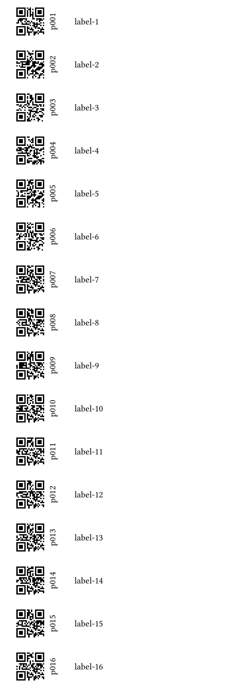

# Labelyst

[](https://github.com/emanuel-kopp/Labelyst.jl/actions/workflows/CI.yml?query=branch%3Amain)
[](https://emanuel-kopp.github.io/Labelyst.jl/dev/)

## Create labels containing QR-codes and human-readable codes for your experiments!

The package exports one function only, `labelyst()`, which takes a `Julia` DataFrame and some additional parameters as inputs and translates it into a [Typst](https://typst.app/) file which is then, if desired, compiled into a PDF.

## Basic usage

The package is registered at the General registry and can be installed with `add Labelyst`. The input `DataFrame` needs to have one column named `ID` and one column named `label`. The `ID` column will be used to make the QR-code, it is advisable not to use too long IDs (e.g. for 500 samples, just use _s001-s500_ or something similar). The column `label` will be used for the human-readable part of the label: here one can add information about treatments, blocks or similar. Depending on the input parameters provided, one of the defined methods of `labelyst()` will be called to flexibly produce labels for different situations (i.e. pot labels, adhesive labels, ...)

# Examples
## Create labels to print on adhesive paper 

```julia
# Create example data
testdf = DataFrame(
    ID=["p001", "p002", "p003", "p004", "p005", "p006", "p007", "p008",
        "p009", "p010", "p011", "p012", "p013", "p014", "p015", "p016"],
    label=["label-1", "label-2", "label-3", "label-4",
            "label-5", "label-6", "label-7", "label-8",
            "label-9", "label-10", "label-11", "label-12",
            "label-13", "label-14", "label-15", "label-16"])
```
```julia
# Create labels (in this example: 16 labels arranged as 8 rows and 2 columns on a DIN A4 paper)
labelyst(testdf,"example_1", "a4", [8, 2]; font_size = "20pt")
```
 


## Create labels for pot experiments
```julia
# Here: one page of size 90mm x 17mm (i.e. a typical size for a pot label) per label
labelyst(testdf,"example_2", ["90mm", "17mm"]; font_size = "10pt")
```



## Multi-line labels

Long label texts will print on multiple lines, and line-breaks can be forced with a double backslash (`\\`).

```julia
testdf = DataFrame(
    ID=["p001", "p002"],
    label=["Treatment: red \\ Block: 2 \\ Contact: S. Omeone",
    "Treatment: blue \\ Block: 1 \\ Contact: S. Omeone"])
```
```julia
# Create labels
labelyst(testdf,"example_3", "a4", [8, 2])
```
 
