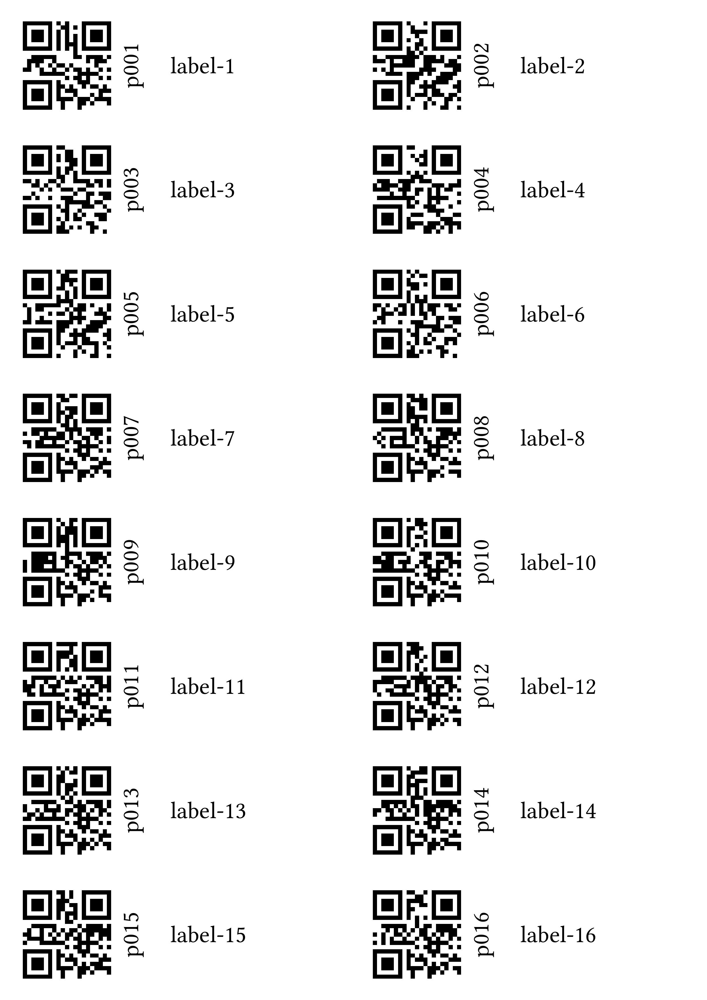

# Labelyst

[](https://github.com/emanuel-kopp/Labelyst.jl/actions/workflows/CI.yml?query=branch%3Amain)

## Create labels containing QR-codes and human-readable codes for your experiments!

The package exports one function only, `labelyst()`, which takes a `Julia` DataFrame and some additional parameters as inputs and translates it into a [Typst](https://typst.app/) file which is then, if desired, compiled into a PDF. To work with `Labelyst.jl` you need Typst installed on your computer, learn about installation [here](https://github.com/typst/typst).

## Basic usage

The input `DataFrame` needs to have one column named `ID` and one column named `label`. The `ID` column will be used to make the QR-code, it is advisable not to use too long IDs (e.g. for 500 samples, just use _s001-s500_ or something similar). The column `label` will be used for the human-readable part of the label: here one can add information about treatments, blocks or similar. Depending on the input parameters provided, one of the defined methods of `labelyst()` will be called to flexibly produce labels for different situations (i.e. pot labels, adhesive labels, ...)

# Examples
## Create labels to print on adhesive paper

```julia
# Create example data
testdf = DataFrame(
    ID=("p001", "p002", "p003", "p004", "p005", "p006", "p007", "p008"),
    label=("label-1", "label-2", "label-3", "label-4",
            "label-5", "label-6", "label-7", "label-8"))
```
```julia
# Create labels
labelyst(testdf,"example_1", "a6", [4, 2] ) # output image rescaled for example
```



## Create labels for pot experiments
```julia
labelyst(testdf, "example_2", ["90mm", "17mm"]) # output image rescaled for example
```


